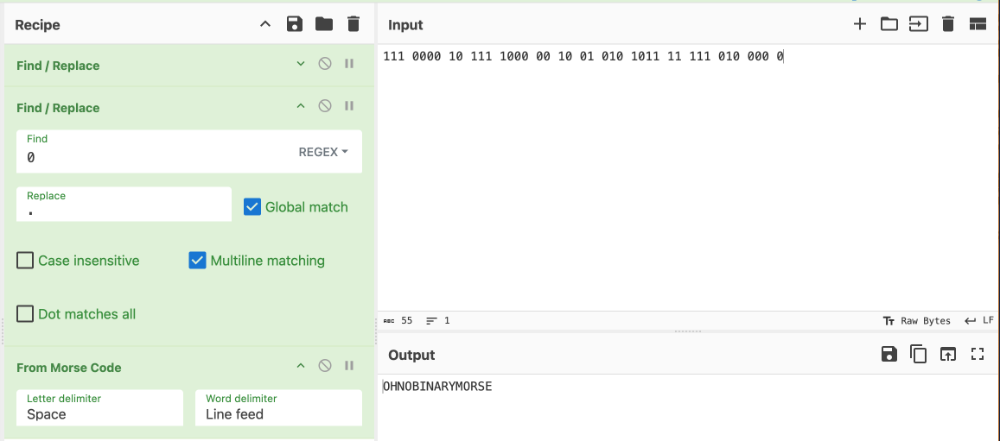

# KashiCTF: Lost Frequencies
### Writeup by hannnper

This challenge gave us a short poem and sequence of ones and zeroes:

> Zeroes, ones, dots and dashes\
> Data streams in bright flashes
> 
> 111 0000 10 111 1000 00 10 01 010 1011 11 111 010 000 0

The poem here is alluding to the flag being hidden in Morse code!

Using cyberchef to decode, first we need to replace the 1's with dashes and 0's with dots, then use the 'From Morse Code' decoder to get the solution:

Revealing the message `OHNOBINARYMORSE`, which gives us the flag `KashiCTF{OHNOBINARYMORSE}`!