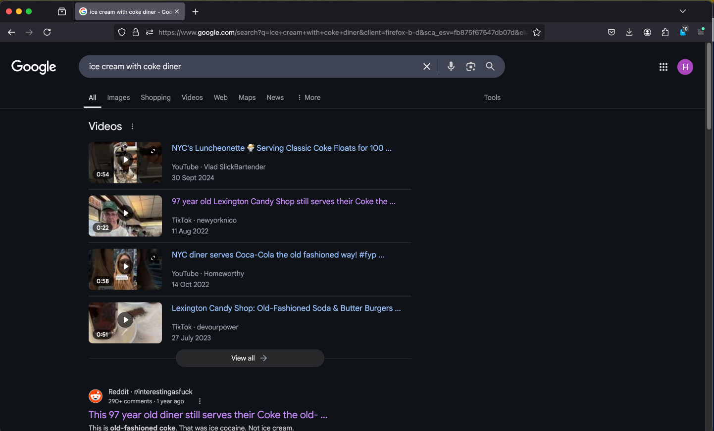
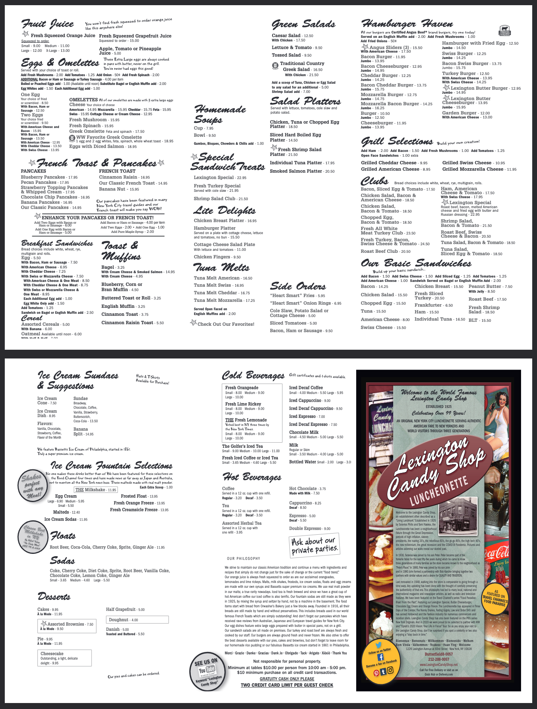
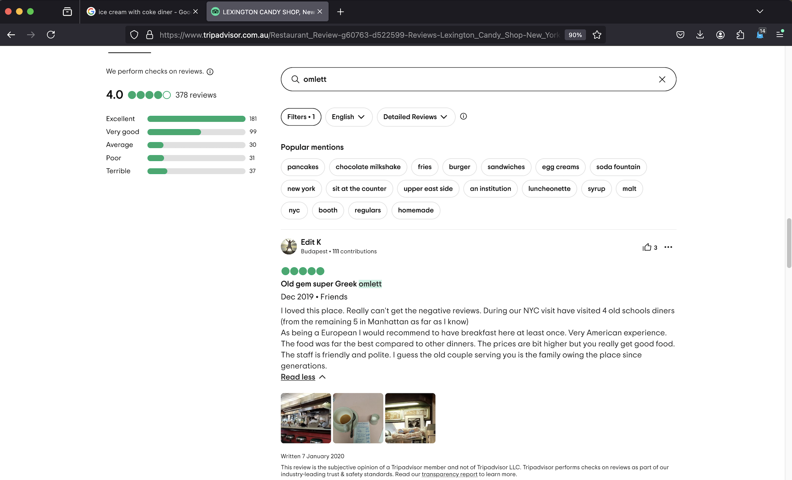
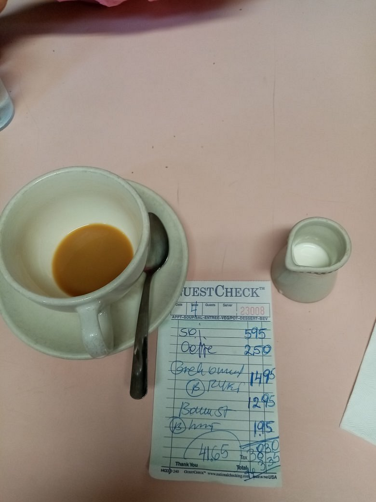

# KashiCTF: Old Diner
### Writeup by hannnper

This challenge asks us to use our OSINT skills to identify a particular diner and amount paid by a particular visitor:

> My friend once visited this place that served ice cream with coke. He said he had the best Greek omlette of his life and called it a very american experience. Can you find the name of the diner and the amount he paid?

Performing a google search for "ice cream with coke diner" predominantly brings up search results for the Lexington Candy Shop in New York, fitting the description of "very american experiance" and "old". 

Checking their website and online menu shows that they do indeed serve a Greek omelette:

However, using the menu to estimate the price paid didn't work (believe us, we tried so many combos, with and without tax & tips 😭).

We needed to find the exact particular person who the clue refers to, and presumably, since this is an OSINT challenge there'll be something useful online.
Searching the google reviews for keywords used in the clue was unfruitful (and scrolling endlessly was equally unfruitful...). But google isn't the only website which allows for reviews, leading us to check out some alternatives - in this case, Tripadvisor! Filtering for positive reviews and scrolling down with an eye out for photos or mentions of pricing, we eventually get to this review (and sigh at yet another creative way to spell 'omlett' that throws off our keyword searches):

Looking closer at the photo of the receipt, we can see the total, $41.65.

So, piecing this together, we get the flag `KashiCTF{Lexington_Candy_Shop_41.65}`!

And now I'm hungry 🤤