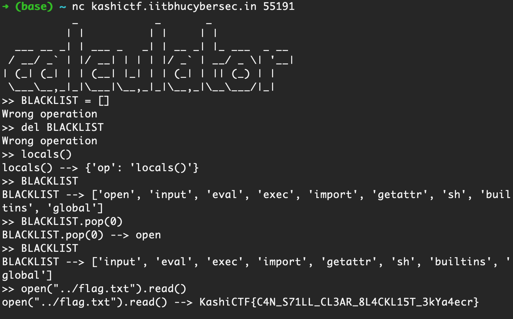

# KashiCTF: Easy Jail 2
### Writeup by hannnper

This challenge extends on the first Easy Jail challenge, giving us updated server code. The description states "I made a completely secure calculator this time." hmmm... 🧐

Alas, it's still vulnerable!

There's now a blacklist to try to prevent us from using some common methods of extracting the flag:

```py3
BLACKLIST = ["open", "input", "eval", "exec", "import", "getattr", "sh", "builtins", "global"]
```

And some input checking has been added, checking if any word in the blacklist is a substring of the user input:

```py3
def main():
	while True :
		inp = input(">> ")
		if any(bad in inp for bad in BLACKLIST) :
			print("Are you tying to hack me !!!!!")
		else : 
			calc(inp)
```

However, there's nothing stopping us from modifying the `BLACKLIST` variable (in python, "constants" are still variables, the all-caps name doesn't protect it from being modified).

As before, statements didn't work, only expressions that evaluate to something that can be assigned to `res` would run successfully. After a few attempts, we were able to use `BLACKLIST.pop(0)` to remove `"open"` from the blacklist and read the flag!



The flag was `KashiCTF{C4N_S71ll_CL3AR_8L4CKL15T_3kYa4ecr}`
