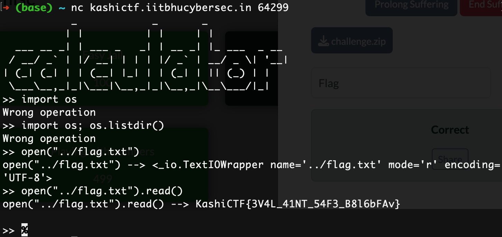

# KashiCTF: Easy Jail
### Writeup by hannnper

In this challenge we are given a zip file containing the server code and a dockerfile, and also given an address to connect to via netcat. The description states "I made this calculator. I have a feeling that it's not safe :(".

The server code contains this section, where an `eval` is used directly on user-input: 
```py3
def calc(op):
	try : 	
		res = eval(op)
	except :
		return print("Wrong operation")
	return print(f"{op} --> {res}")

def main():
	while True :
		inp = input(">> ")
		calc(inp)
```

This means we can type any expression at the prompt and it will be evaluated and shown as output. The relative filepath of the flag can be determined from the dockerfile:

```dockerfile
WORKDIR /challenge

COPY chall.py /challenge/chall.py
COPY flag.txt /flag.txt
```

Connecting to the server using `nc`, it prompts us to enter the desired operation.
Using python's buitin `open()` function and `.read()` method we can read the flag from the file:



Which gives us the flag `KashiCTF{3V4L_41NT_54F3_B8l6bFAv}`!
