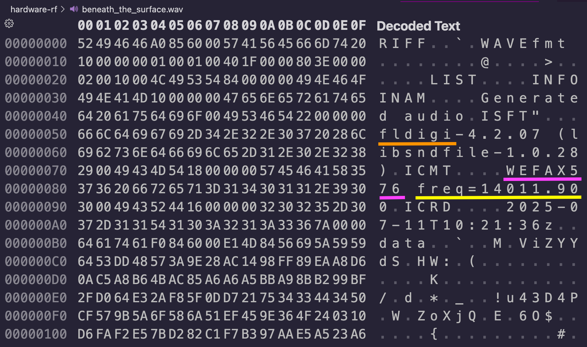
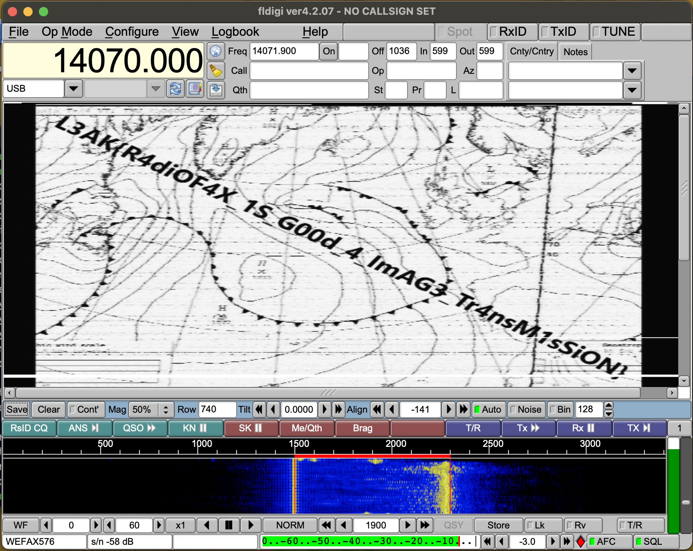

# L3ak CTF 2025: Beneath the Surface
### Writeup by hannnper

Beneath the surface gives us this description:

> On the surface, this signal is nothing but meaningless noise — a mere whisper of the wind. But dive deeper into this transmission, and a storm begins to take shape, with gray skies gathering on the horizon. Can you navigate through the static and uncover what lurks beneath the surface of the wav — before it’s too late?

And a `beneath_the_surface.wav` file.

Inspecting the hex of the `.wav` file shows some interesting metadata:

From this we know that the format is WEFAX576 (an old format used for transmitting weather charts and meteoroligical reports over fax, [SigIDwiki: WEFAX](https://www.sigidwiki.com/wiki/WEFAX)), that it's using the frequency of 14011.90, and that fldigi was used to create it.

I downloaded fldigi from their website and opened up the wav file by going to the `File>Audio>Playback` option in the menu bar.

Probably should have set the frequency to match, but it worked anyway, eventually revealing:

And after a few attempts confusing `0`s with `O`s, I got the flag, `L3AK{R4diOF4X_1S_G00d_4_ImAG3_Tr4nsM1sSiON}`.

