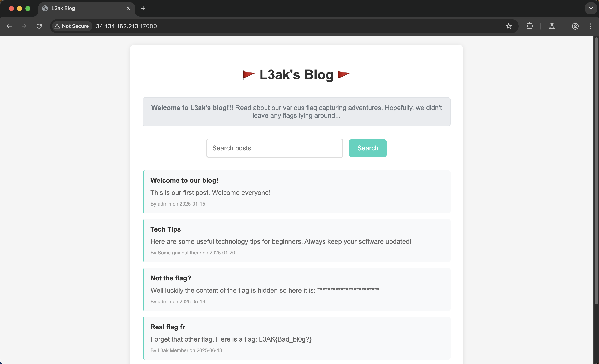
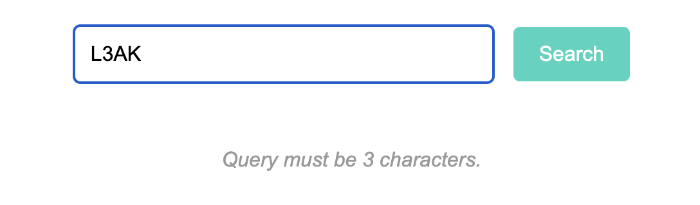
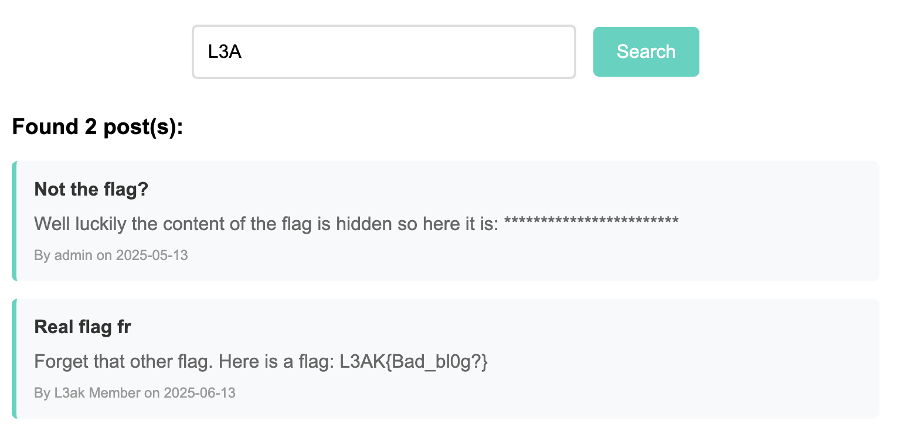
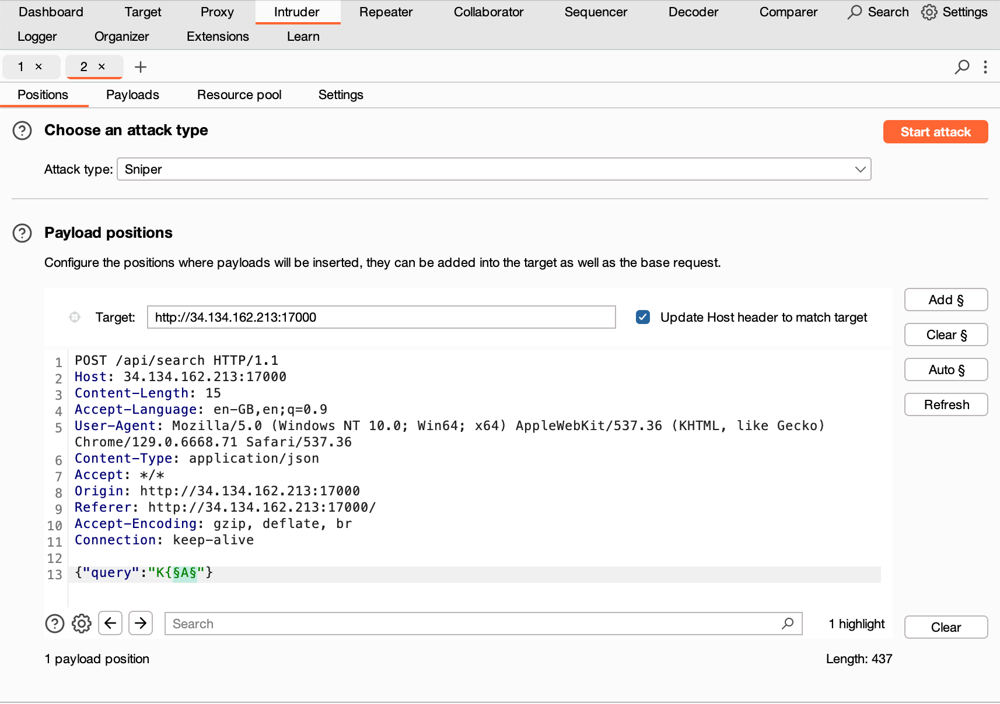
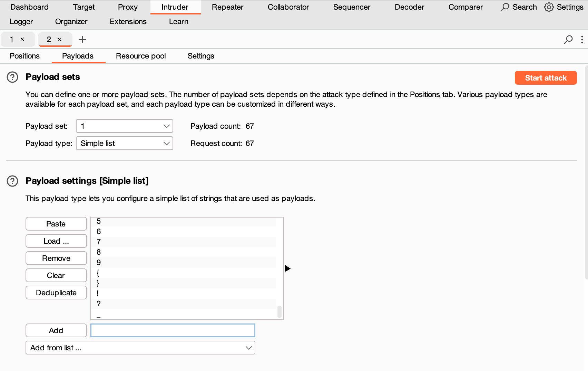
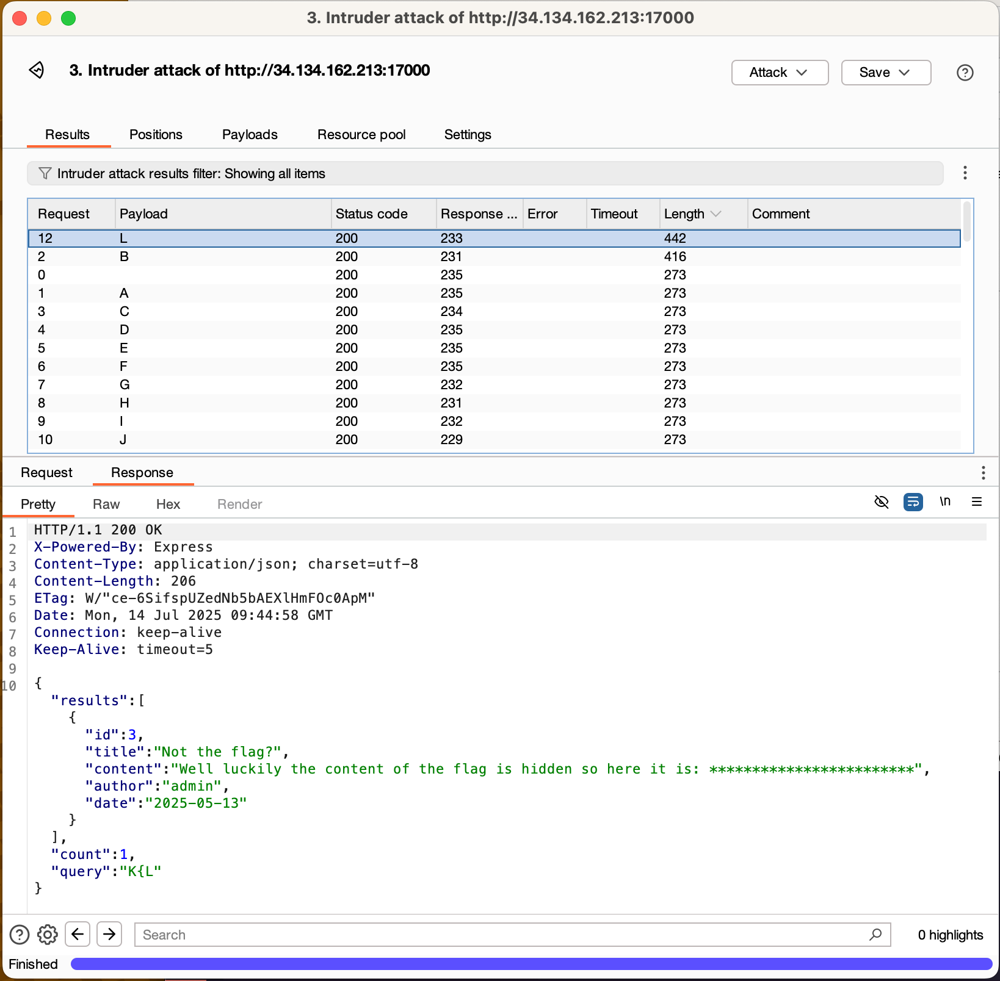

# L3ak CTF 2025: Flag L3ak
### Writeup by hannnper

Flag L3ak is a web challenge, with the flag so obvious right there on the front page:



But of course the challenge writers wouldn't make it that easy, the real flag is converted to asterisks in both the `/api/posts` and `/api/search` endpoints.

```js
app.post('/api/search', (req, res) => {
    const { query } = req.body;
    
    if (!query || typeof query !== 'string' || query.length !== 3) {
        return res.status(400).json({ 
            error: 'Query must be 3 characters.',
        });
    }

    const matchingPosts = posts
        .filter(post => 
            post.title.includes(query) ||
            post.content.includes(query) ||
            post.author.includes(query)
        )
        .map(post => ({
            ...post,
            content: post.content.replace(FLAG, '*'.repeat(FLAG.length))
    }));

    res.json({
        results: matchingPosts,
        count: matchingPosts.length,
        query: query
    });
});
```

However, note that the search is being performed on the flag before it is converted to asterisks, so a 3-character search like `L3A` returns both the fake flag and the real one. So it is possible to exfiltrate characters from the flag by seeing if the post is included in search results.





I used Burp Suite intruder in `sniper` mode to query each next character of the flag, beginning with the characters that are part of the known flag format `L3AK{...}`. So the query comprised of the 2 last known characters and then fuzzed on the third:



Using the `add from list` option to quickly add `A-Z`, `a-z`, and `0-9` to the payload settings and then adding a few characters that are likely to appear such as `{`, `}`, `!`, `?`, and `_`:



(I also unselected the URL-encode characters option)

Running this reveals a character at a time:



For some there were multiple matches possible for the 3rd character, but it was possible to tell by inspection which was the search that matched something in the real flag but not the rest of the post (including author name!).

I really should have automated this repetitve process, but instead decided to do it manually...

Luckily the flag isn't too long, `L3AK{L3ak1ng_th3_Fl4g??}`

