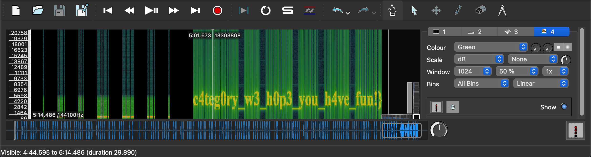

# L3ak CTF 2025: Strange Transmission
### Writeup by hannnper

Strange transmission provides us with the description:

> I received this strange transmission and I'm not sure what to make of it! Weird beeps, static noise, then silence. Can you help me figure out what it all means?

And a `strange-transmission.wav` file.

Opening this file in Sonic Visualiser and adding a spectogram layer reveals some visible text (the second half of the flag) and some wide and thin stripes:



The stripes look like morse code, and transcribe to:

```
--- .... .-- --- .-- -.-- --- ..- ..-. --- ..- -. -.. --- ..- .-. ... . -.-. .-. . - -- --- .-. ... . -.-. --- -.. . .- ..- -.. .. --- .-- . .-.. .-.. -.. --- -. . .... . .-. . .. ... - .... . ..-. .. .-. ... - .... .- .-.. ..-. --- ..-. - .... . ..-. .-.. .- --. .-.. ...-- .- -.- --- .--. . -. -... .-. .- -.-. -.- . - .-- . .-.. -.-. ----- -- ...-- ..- -. -.. . .-. ... -.-. --- .-. . - ----- ..- -. -.. . .-. ... -.-. --- .-. . - .... ...-- ..- -. -.. . .-. ... -.-. --- .-. . .... ....- .-. -.. .-- ....- .-. ...-- ..- -. -.. . .-. ... -.-. --- .-. . .-. ..-. ..- -. -.. . .-. ... -.-. --- .-. . 
```

A bit tedious to manually type out, surely there's a better way 😅

Using an online morse code converter we get:

```
OHWOWYOUFOUNDOURSECRETMORSECODEAUDIOWELLDONEHEREISTHEFIRSTHALFOFTHEFLAGL3AKOPENBRACKETWELC0M3UNDERSCORET0UNDERSCORETH3UNDERSCOREH4RDW4R3UNDERSCORERFUNDERSCORE
```

Giving us the final flag, `L3AK{WELC0M3_T0_TH3_H4RDW4R3_RF_c4teg0ry_w3_h0p3_you_h4ve_fun!}`
