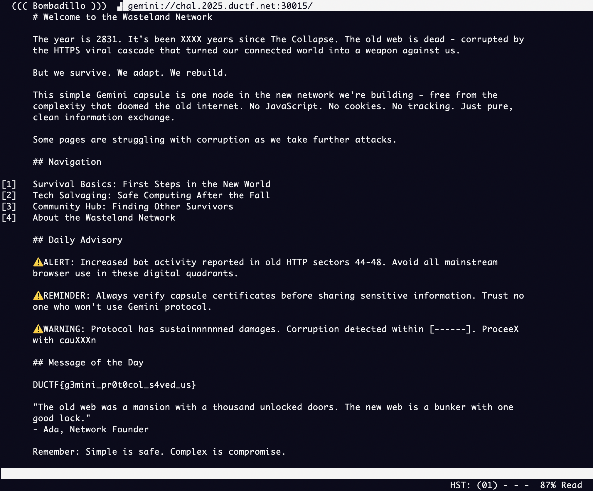

# duCTF 2025: Horoscopes
### Writeup by hannnper

We're given a host and port to connect to and this message:

> Hey Sis! Its getting pretty bad out here.. they keep telling us to connect on this new and improved protocol. The regular web is being systematically attacked and compromised
>
> Little Tommy has been born! He's a Taurus just a month before matching his mum and dad! Hope to see you all for Christmas
>
> Love, XXXX

Between the title of this challenge and the part that says "a Taurus just a month before", this immediately made me think of the [gemini protocol](https://en.wikipedia.org/wiki/Gemini_(protocol)), which is a text-focussed network protocol. It's similar to gopher but requires TLS (transport layer security). Gemini also *doesn't* have stuff like javascript or cookies that http/https has, so it's a lot more simple and has less room for security flaws. So it's perfect for when "regular web is being systematically attacked and compromised"!

I've previously used [Bombadillo](https://bombadillo.colorfield.space/) for exploring geminispace so that's what I used this time. [Lagrange](https://gmi.skyjake.fi/lagrange/) also seems like a good option if you prefer a GUI (graphical user interface).

So, in my command line I typed in:

```shell
bombadillo gemini://chal.2025.ductf.net:30015 
```

Which showed this gemini capsule:



And the flag is right there in the message of the day, `DUCTF{g3mini_pr0t0col_s4ved_us}`!

Side-note: doesn't this totally make you want to make your own Gemini capsule!? 💎

Next part -> [Wiki](../wiki/wiki.md)

