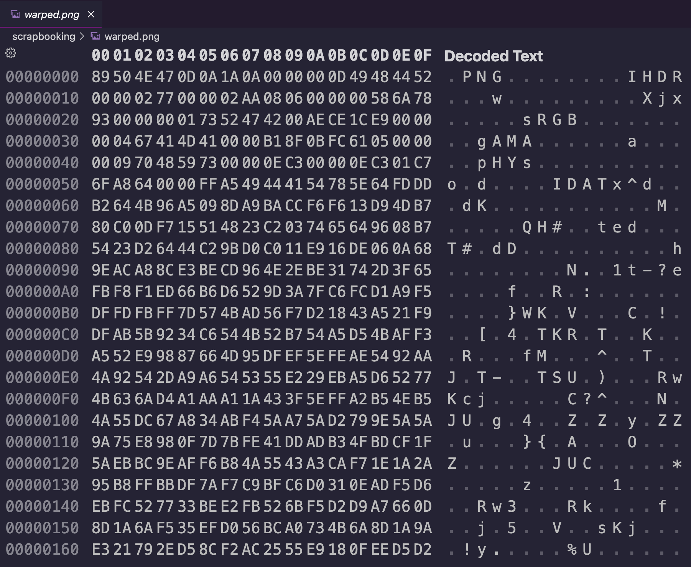
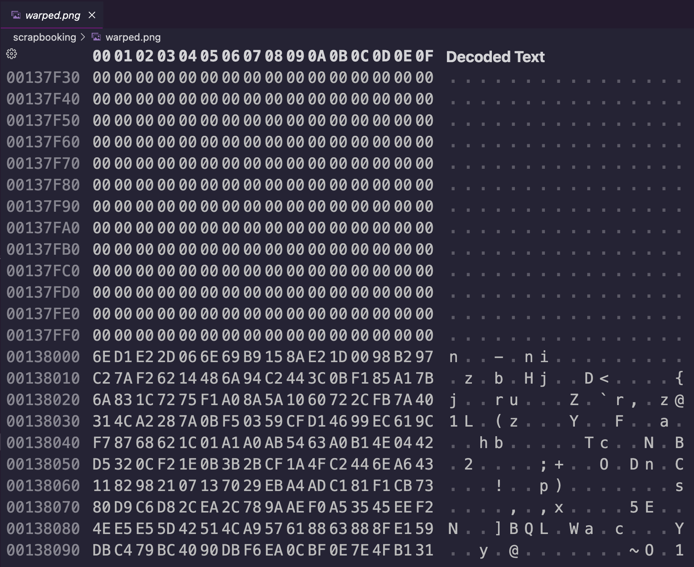
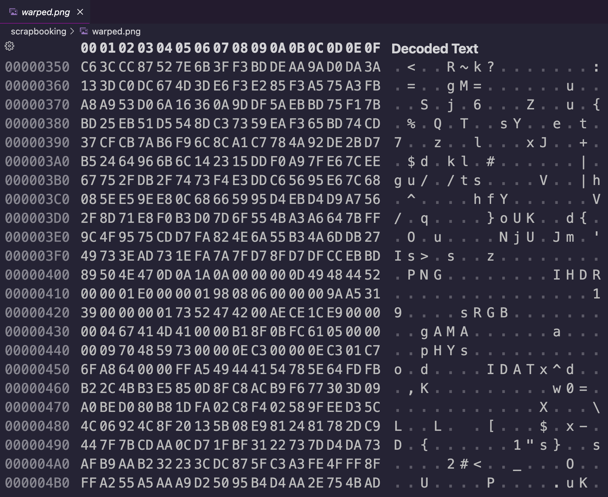
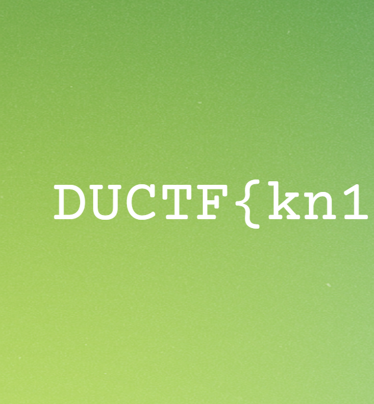

# duCTF 2025: Scrapbooking
### Writeup by hannnper

For this challenge we're given the [warped.png](warped.png) file and a description:

> Rummaging through the ruins of an old server and next to some scissors and glue you find the remants of what looks like a PNG file.

The warped.png file looks corrupted (looks empty in an image viewer) and the description alludes to it being cut up and reassembled. Opening it up in VS code's `hex view` shows a fairly standard start of the file:



A quick scroll through the file reveals there are large parts of blank bytes within the file, which is quite unusual. 



My first attempt at solving this involved dividing it up into sections broken at the blank parts of file and trying every permutation and then checking if the file was valid. This of course didn't work and just created a whole bunch of files that were even more corrupted 🙃

Having another look at the structure of the file, I noticed something else unusual: there was another png header in the file! The header of the file (also called magic bytes or file signature) is supposed to be at the start of a file and is one of the attributes used to tell what kind of file it is. For a png (portable network graphic) that should be bytes `89 50 4E 47 0D 0A 1A 0A` (though I just focused on the first 4 bytes of this). The `50 4E 47` part of this is the letters `PNG`.



Searching through the file I found 3 occurances of `PNG` in the file. I also searched for `IEND`, which marks the end of a png file, and also found 3. So we have 3 files mixed in here.

The first header was at location `0x00000000` in the file, the second at `0x00000400` (1024 in decimal), and the third at `0x00000800` (2048 in decimal). This looks like the chunks are the same size, each 1024 bytes long until switching to the next chunk. (note: I'm using 'chunk' informally here, not the formal definition of a png chunk)

So I decided to break the file up into 1024 byte chunks:
```python
filename = "warped.png"
with open(filename, "rb") as f:
    data = f.read()

# break into 1024-byte chunks
CHUNK_SIZE = 1024
chunks = [data[i:i+CHUNK_SIZE] for i in range(0, len(data), CHUNK_SIZE)]
```

There were 1533 chunks in total!

I also tried filtering out any chunks that were all-zero bytes, however this was definitely wrong. You need those chunks!

I tried sanity checking the indices of the headers and end tags (including the all-zero chunks):
```
PNG headers found at: [0, 1, 2]
PNG IEND found at: [721, 797, 1530]
```

I considered dividing the chunks into categories based on what png tags they contained to get an idea of whether the chunk was supposed to go at the beginning, end, or somewhere in the middle. This step wasn't that useful, and I didn't end up using these split up lists, but it did make me consider the feasibility of the different ways to try reconstring the pngs. Even with some information about start and end blocks, there were way too many to try all permutations.

Given the number of how many 1024-byte chunks there are in the whole warped file, it would be infeasible to have to guess which of the 3 pngs a chunk belonged to, so they were likely interspersed evenly from each png.

Checking the end tags aligned with this theory:

```python
print(721 % 3)   # 0
print(797 % 3)   # 1
print(1530 % 3)  # 2
```

I decided to try putting the pngs together in the order given first.

```python
# assume i % 3 belongs to png i
png0 = [chunk for i, chunk in enumerate(chunks) if i % 3 == 0]
png1 = [chunk for i, chunk in enumerate(chunks) if i % 3 == 1]
png2 = [chunk for i, chunk in enumerate(chunks) if i % 3 == 2]
```

I then did some extra sanity checks to check where the `IEND` occured and that any blank chunks occured after the `IEND`.

The final step was joining the chunks together and checking if they created 3 valid pngs.

```python
# join the chunks back together
reassembled_png0 = b''.join(png0)
reassembled_png1 = b''.join(png1)
reassembled_png2 = b''.join(png2)

with open("reassembled_pngs/reassembled_0.png", "wb") as f:
    f.write(reassembled_png0)
with open("reassembled_pngs/reassembled_1.png", "wb") as f:
    f.write(reassembled_png1)
with open("reassembled_pngs/reassembled_2.png", "wb") as f:
    f.write(reassembled_png2)
```

(yikes repetitive code, if I were grading my code I'd deduct marks for that 😅)

Thankfully, it worked! The pngs are valid and each one reveals another part of the flag!




`DUCTF{kn1tting_with_pngs}`

