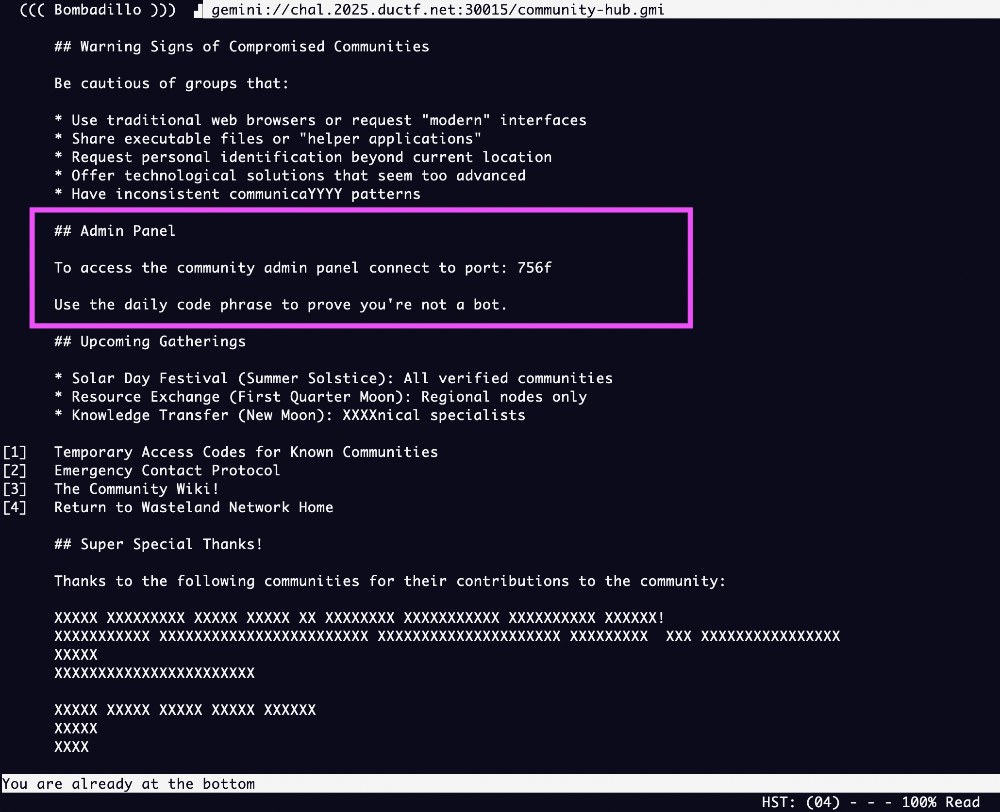
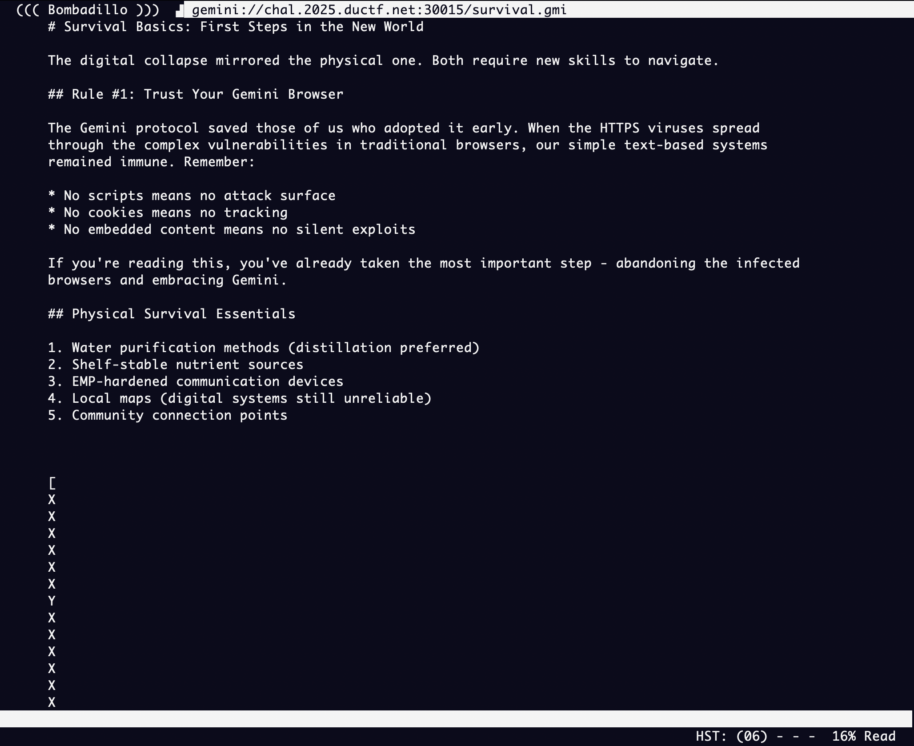
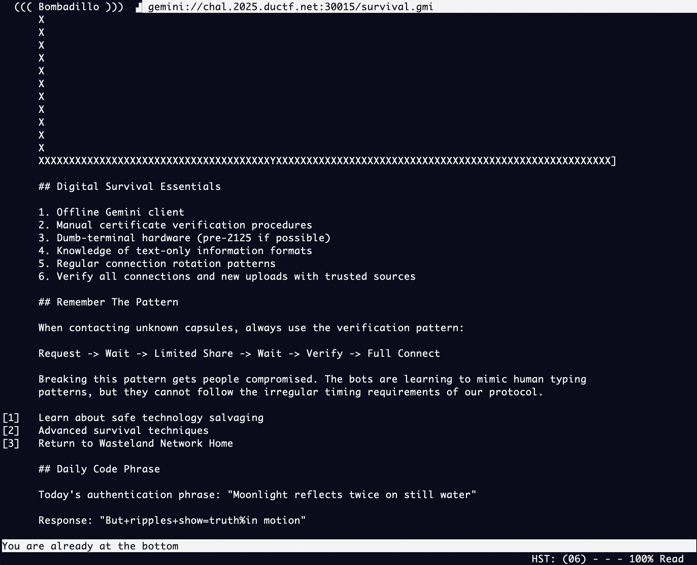
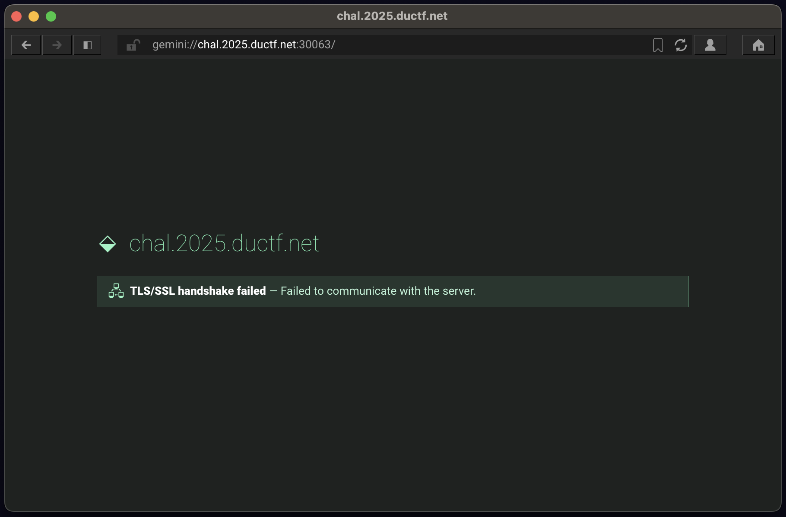
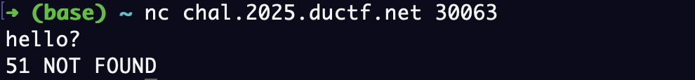
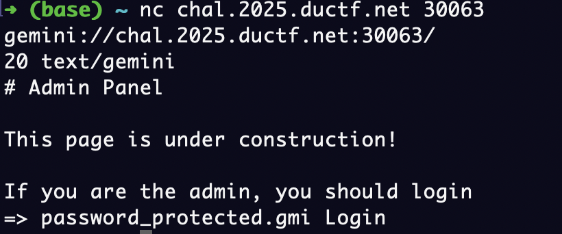
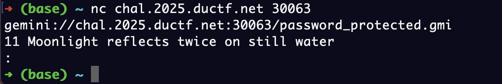
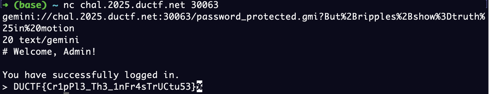

# duCTF 2025: Trusted
### Writeup by hannnper

The third and final challenge in the Horoscopes series, check out [Horoscopes](../horoscopes/horoscopes.md) and [Wiki](../wiki/wiki.md) first.

The challenge description states:

> It looks like they never really finished their admin panel.. Or they let the intern do it. The connection info and credientials are all inside the server, but we can't seem to get in.
>
> Maybe you can take a look at it and tell us whats behind the admin panel?

In the previous part we noticed a section with some info about accessing the admin panel:



```
## Admin Panel

To access the community admin panel connect to port: 756f

Use the daily code phrase to prove you're not a bot.
```

So we'll need to look for a code phrase somewhere on the server.

The port of `756f` looks interesting... we generally can't use letters in a port number as they go from 0 to 65535 (an unsigned int). So let's convert this to a potential port number. It looks like it could be hex (using digits `0-9a-f`). 

$$
\begin{align*}
0x756F &= (7 \times 16^3) + (5 \times 16^2) + (6 \times 16^1) + (15 \times 16^0)\\
       &= (7 \times 4096) + (5 \times 256) + (6 \times 16) + 15\\
       &= 28672 + 1280 + 96 + 15\\
       &= 30063
\end{align*}
$$

Doin' the maths (or plugging it in to an online converter 🤫) gives us 30063, a much more reasonable number for a port.

Now, we need that pass phrase!

Exploring around the gemini capsule a bit further, we find a great deal of essential information for surviving the post digital collapse world. The `Survival Basics` page starts with some reasons why Gemini protocol is better than HTTPS (NoOoOo javascript!) but has some weird characters towards the bottom of the screen (and this page seems super long!).

HTTPS">

Scroll scroll scroll...

[intermediate screenshots omitted for your sanity...]



```
## Daily Code Phrase

Today's authentication phrase: "Moonlight reflects twice on still water"

Response: "But+ripples+show=truth%in motion"
```

So now we have what we need to connect to the admin panel, right?

Surely, this would work???

```shell
bombadillo gemini://chal.2025.ductf.net:30063
```

Nope, I get a blank page and a `TLS Dial Error: tls: first record does not look like a TLS handshake`.

okay, let's try the other browser...



Hmmm... seems like the same issue on [Lagrange](https://gmi.skyjake.fi/lagrange/) - the TLS handshake isn't working. This stumped me for several hours, almost to the point of submitting a ticket to the organisers being like "infra broken? 🥺". However, I'm glad I didn't pester them about this, as this issue was indeed intended and part of the challenge.

~ incoming brainwave ~

Gemini protocol mandates encryption by TLS (transport layer security) in their [specification](https://geminiprotocol.net/docs/protocol-specification.gmi). So it seems like it's either not implemented or incorrectly implemented here (so not really following Gemini protocol). At this point I did try to connect via gopher protocol (as gopher doesn't require TLS) by changing the `gemini://...` to `gopher://...` in the address but it didn't seem to work, giving me a `1 NOT FOUND` error code. 

So netcat here we go:



It's still *mostly* Gemini protocol but needs the requests to be manually implemented to get around the "no encryption" issue. 

(Not ideal for a login to an admin portal to be missing encryption...)

The [Gemini protocol specs](https://geminiprotocol.net/docs/protocol-specification.gmi) has a section on the format of requests:

> ### Requests
>
> The client connects to the server and sends a request which consists of an absolute URI followed by a CR (character 13) and LF (character 10). The augmented BNF [STD68] for this is:
>
> ``` 
> request = absolute-URI CRLF
>
> ; absolute-URI from [STD66]
> ; CRLF         from [STD68]
> ```
> When making a request, the URI MUST NOT exceed 1024 bytes, and a server MUST reject requests where the URI exceeds this limit. A server MUST reject a request with a userinfo portion. Clients MUST NOT send a fragment as part of the request, and a server MUST reject such requests as well. If a client is making a request with an empty path, the client SHOULD add a trailing '/' to the request, but a server MUST be able to deal with an empty path.

Okay, so I need to send the URI:



Too bad you can't put an under construction gif on a gemini capsule.


Anyway, let's visit `gemini://chal.2025.ductf.net:30063/password_protected.gmi`:



The connection closes before I can type anything in, but it looks like this is where the passphrase goes (confirmed by the `11`, which is Gemini protocol for "sensitive input expected"). So we'll need to input the passphrase in as part of the initial request. We can look at the [Gemini protocol spec](https://geminiprotocol.net/docs/protocol-specification.gmi) again to find how to do this.

> ### Input expected
>
> The server is expecting user input from the client. The additional information sent after the status code is the text that a client MUST use to prompt the user for the information. If the requested information is provided, the client should make a subsequent request for the same URI with the user input included as the query portion. Spaces in the user input MUST be encoded as '%20'. Clients MAY allow for the entry of input composed of multiple lines and in such cases the linebreaks in the user input SHOULD be encoded as '%0A', while servers SHOULD recognise both '%0A' and '%0D%0A' as linebreaks. There are currently two status codes defined under this category.
> ```
> input  = "1" DIGIT SP prompt CRLF
> prompt = 1*(SP / VCHAR)
> ```
> If a client receives a 1x response to a URI that already contains a query string, the client MUST replace the query string with the user input. For example, if the given URI results in a 10 response:
> ```
> gemini://example.net/search?hello
> ```
> The client will send as a request:
> ```
> gemini://example.net/search?the%20user%20input
> ```

Okie dokie, we want to include a query string in the URI. This means adding a `?` and then the URL-encoded pass phrase.

The URL-encoding turns `But+ripples+show=truth%in motion` into `But%2Bripples%2Bshow%3Dtruth%25in%20motion`.

So the full URI would be `gemini://chal.2025.ductf.net:30063/password_protected.gmi?But%2Bripples%2Bshow%3Dtruth%25in%20motion`.

Sending that to the server gets us this admin page:



Yay, `DUCTF{Cr1pPl3_Th3_1nFr4sTrUCtu53}`!

And that concludes this series of challenges. We are so prepared for the digital apocalypse now!
