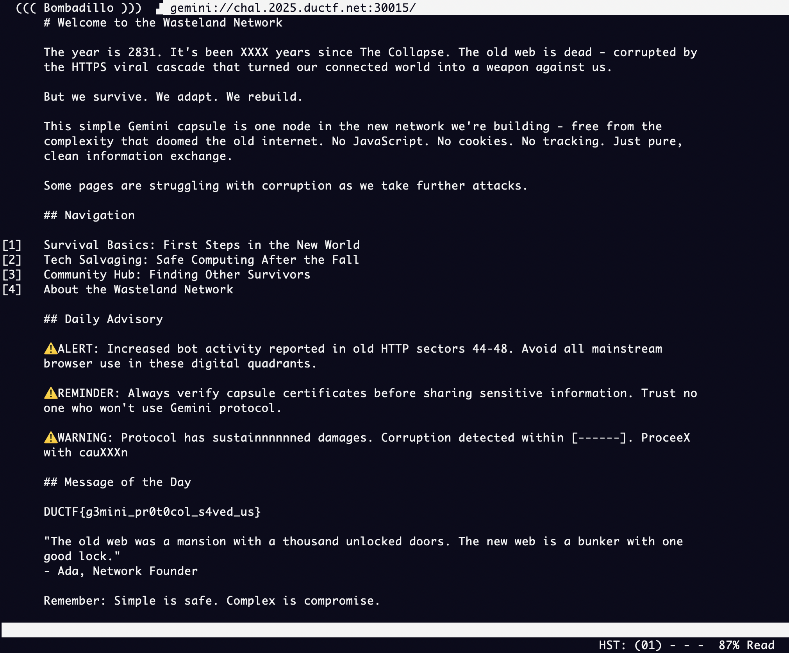
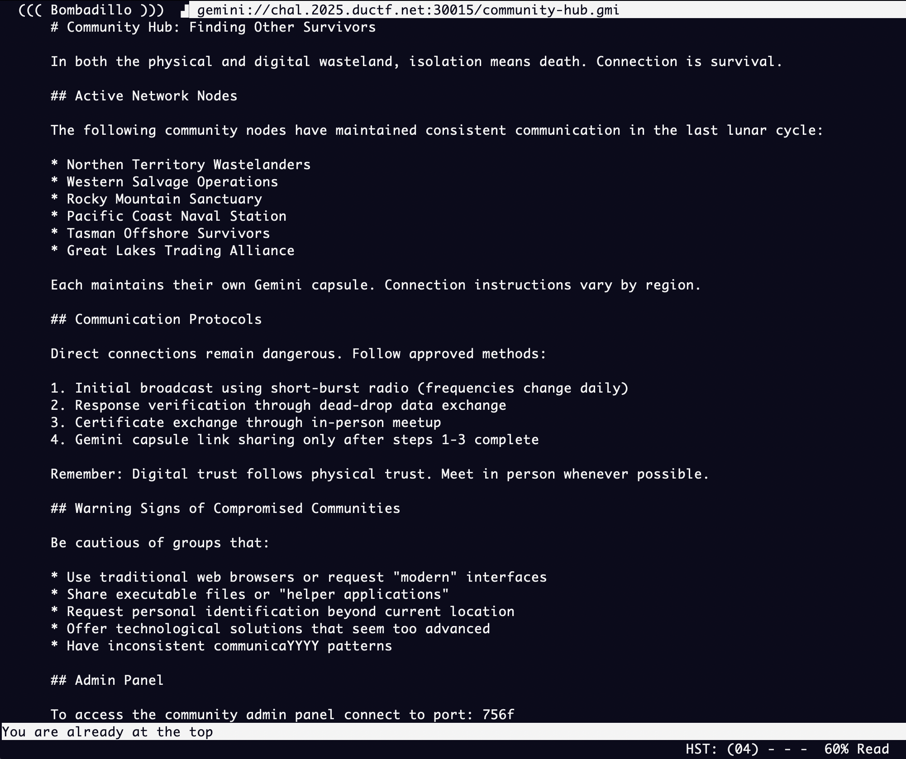
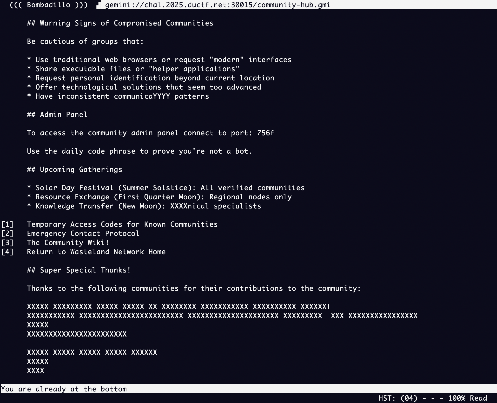
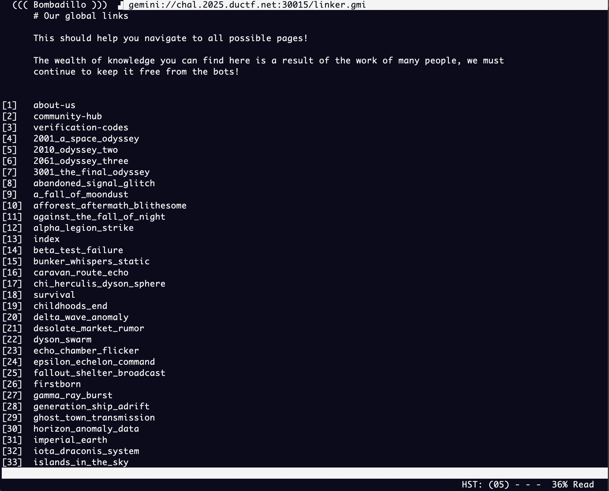
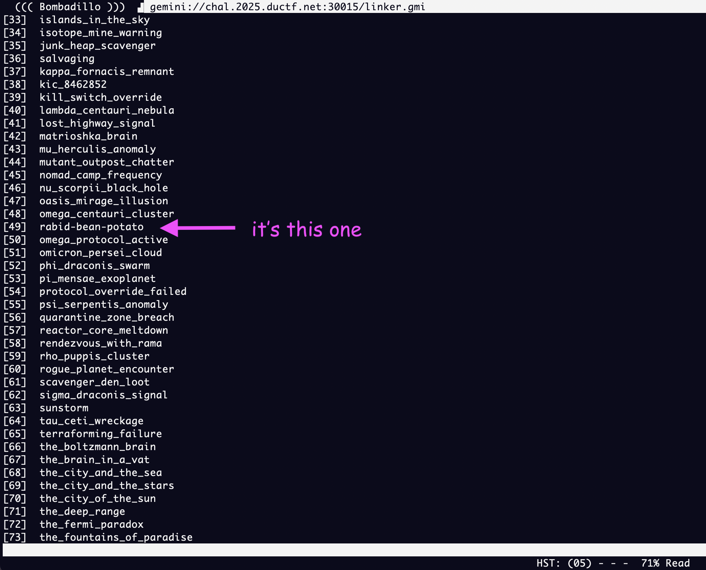
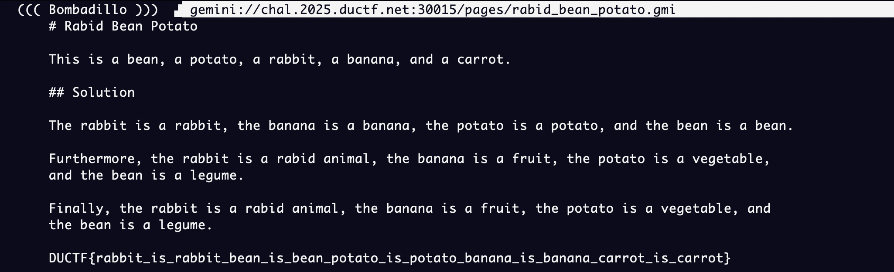

# duCTF 2025: Wiki
### Writeup by hannnper

This challenge is a continuation of [Horoscopes](../horoscopes/horoscopes.md) and the instructions are quite simple, "Use the Wiki to find the flag...".

So starting where [Horoscopes](../horoscopes/horoscopes.md) left off, with the aim to look around the wiki. On that landing page, there's a few links to other pages under the `Navigation` heading.



I explored around the capsule without specifically focusing on finding the wiki at first, since it's got some pretty cool post-internet-apocalypse vibes! To move around in the [Bombadillo](https://bombadillo.colorfield.space/) browser you can use the `j` key to scroll down and the `k` key to scroll up. To follow a link you type in the number (though if there's more than one digit you need to press either `spacebar` or `:` first). To go back a page press the `h` key (`b` also works) and to go forwards press the `l` key.

```
      ## Navigation
      
[1]   Survival Basics: First Steps in the New World
[2]   Tech Salvaging: Safe Computing After the Fall
[3]   Community Hub: Finding Other Survivors
[4]   About the Wasteland Network
```

Since a wiki is a community effort, the community hub is a reasonable place to check out. Pressing `3` key takes us to this page:



Scrolling down the page (`j` key!) gets us to this part:



(Note the info in the admin panel section, as that will be useful for the next challenge!)

At the bottom of the page there's more links (mostly broken), but the one of interest is `[3] The Community Wiki!`, which takes us to:



AAAaaAaAaaaaaaAaAaaaaAa! There's 104 links in total. Have fun checking each and every one of them, the flag's in there somewhere 🤪



While you're at it read through all the lore from the survivors of the internet apocalypse.



And there it is! `DUCTF{rabbit_is_rabbit_bean_is_bean_potato_is_potato_banana_is_banana_carrot_is_carrot}`

Next part -> [Trusted](../trusted/trusted.md)

